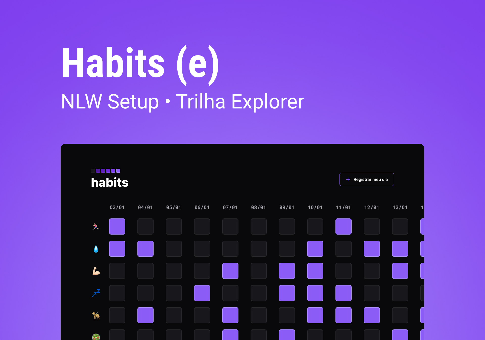

<h1 align="center"> My Habits </h1>

  <a href="#-technologies">Technologies</a>&nbsp;&nbsp;&nbsp;|&nbsp;&nbsp;&nbsp;
  <a href="#-project">Project</a>&nbsp;&nbsp;&nbsp;|&nbsp;&nbsp;&nbsp;
  <a href="#-layout">Layout</a>&nbsp;&nbsp;&nbsp;|&nbsp;&nbsp;&nbsp;
  <a href="#memo-license">License</a>&nbsp;&nbsp;&nbsp;|&nbsp;&nbsp;&nbsp;
  <a href="#readme-in-portuguese">README in Portuguese</a>

  

 
 

  

## 🚀 Technologies
This project was developed with the following technologies:

- HTML and CSS
- JavaScript
- Git and Github
- Figma 

## 💻 Project

Habits is an app to help track habits.

- [Access the finished project online](https://fernandoalvesrufino.github.io/nlw-11-habit-tracker/)

## 🔖 Layout

You can view the project layout through [THIS LINK](https://www.figma.com/community/file/1195327109778210238). You need to have a [Figma account](https://figma.com) to access it.

## :memo: License
This project is under the MIT license.

 
 

## README in Portuguese

<h1 align="center"> My Habits </h1>

  <a href="#-tecnologias">Tecnologias</a>&nbsp;&nbsp;&nbsp;|&nbsp;&nbsp;&nbsp;
  <a href="#-projeto">Projeto</a>&nbsp;&nbsp;&nbsp;|&nbsp;&nbsp;&nbsp;
  <a href="#-layout">Layout</a>&nbsp;&nbsp;&nbsp;|&nbsp;&nbsp;&nbsp;
  <a href="#memo-licença">Licença</a>

  

 

  

## 🚀 Tecnologias

Esse projeto foi desenvolvido com as seguintes tecnologias:

- HTML e CSS
- JavaScript
- Git e Github
- Figma

## 💻 Projeto

O Habits é um app para ajudar a rastrear os hábitos.

- [Acesse o projeto finalizado, online](https://fernandoalvesrufino.github.io/nlw-11-habit-tracker/)

## 🔖 Layout

Você pode visualizar o layout do projeto através [DESSE LINK](https://www.figma.com/community/file/1195327109778210238). É necessário ter conta no [Figma](https://figma.com) para acessá-lo.

## :memo: Licença

Esse projeto está sob a licença MIT.

---

by Fernando Rufino

`Baseado no projeto criado pela Rocketseat durante a semana NLW Setup`
